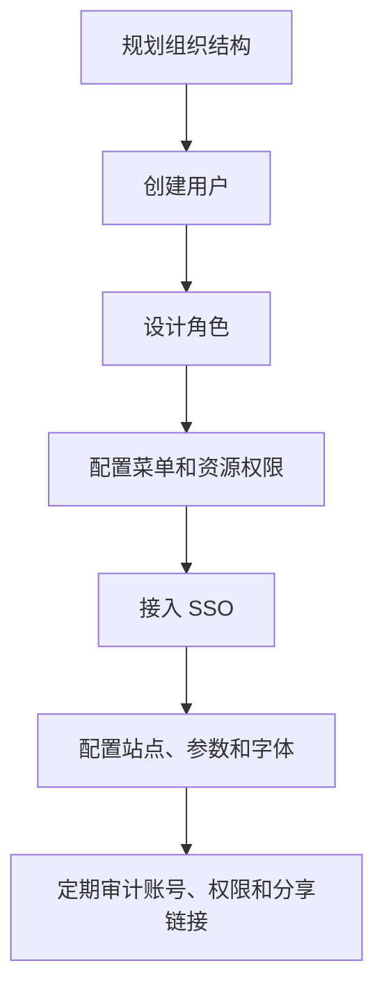

本章面向平台管理员、项目实施人员和安全负责人。管理员负责账号生命周期、组织结构、角色边界、资源权限、单点登录、站点配置、审计追踪和日常治理，是平台稳定运行和权限安全的主要负责人。

## 管理员工作范围

| 工作 | 目的 |
| --- | --- |
| 用户与组织 | 建立清晰的人员归属和账号生命周期 |
| 角色管理 | 将岗位职责沉淀为可复用角色 |
| 权限管理 | 控制菜单、功能和资源访问范围 |
| 系统参数 | 控制平台级行为和运行策略 |
| 站点与字体 | 统一品牌展示和可视化渲染效果 |
| 单点登录 | 对接企业身份系统 |
| 审计日志 | 追踪关键操作，支撑安全审计 |

## 管理顺序建议

<Callout type="info" title="权限设计建议">
  先按岗位设计角色，再把用户加入角色。不要为了一个人临时堆权限，否则后续很难判断权限来源。
</Callout>

## 管理员日常检查

| 频率 | 检查项 |
| --- | --- |
| 每日 | 异常登录、导出失败、关键资源变更 |
| 每周 | 新增账号、离职账号、分享链接 |
| 每月 | 角色权限、管理员账号、SSO 状态、审计日志 |
| 项目结束 | 回收临时账号、关闭临时分享、归档交付资源 |

## 后续章节

<Cards>
  <Card title="用户与组织" href="/docs/crest/admin-guide/users-orgs">
    创建账号、维护组织、处理账号启停和人员变更。
  </Card>
  <Card title="角色与权限" href="/docs/crest/admin-guide/roles-permissions">
    设计角色、授权菜单、控制资源访问。
  </Card>
  <Card title="系统、站点与字体" href="/docs/crest/admin-guide/system-site-font">
    管理系统参数、站点标识和可视化字体。
  </Card>
  <Card title="单点登录" href="/docs/crest/admin-guide/sso">
    对接企业身份系统并管理默认权限。
  </Card>
  <Card title="审计与账号安全" href="/docs/crest/admin-guide/audit">
    查看审计日志、修改密码、排查异常操作。
  </Card>
</Cards>
