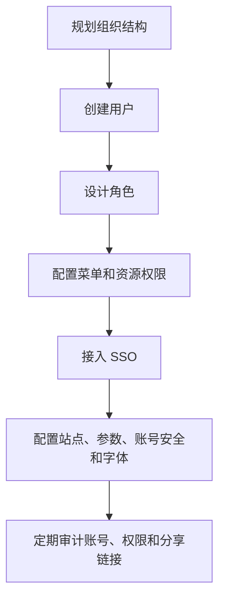

本章面向平台管理员、项目实施人员和安全负责人。管理员负责账号生命周期、组织结构、角色边界、资源权限、单点登录、站点配置、审计追踪和日常治理，是平台稳定运行和权限安全的主要负责人。

管理员工作不应依赖发现问题后的临时调整。建议先搭好组织、用户、角色和权限，再配置 SSO、站点、字体、审计和分享治理。权限基础不稳定，后续数据源、数据集、仪表盘和大屏都会出现“谁能看、谁能改、谁负责”的问题。

## 管理员工作范围

| 工作 | 目的 |
| --- | --- |
| 用户与组织 | 建立清晰的人员归属和账号生命周期 |
| 角色管理 | 将岗位职责沉淀为可复用角色 |
| 权限管理 | 控制菜单、功能和资源访问范围 |
| 系统参数 | 控制平台级行为、账号安全和运行策略 |
| 站点与字体 | 统一品牌展示和可视化渲染效果 |
| 单点登录 | 对接企业身份系统 |
| 审计日志 | 追踪关键操作，支撑安全审计 |

## 管理顺序建议

下面这条顺序适合新环境初始化，也适合接手权限边界不清的旧环境时重新梳理。

<Callout type="info" title="权限设计建议">
  先按岗位设计角色，再把用户加入角色。不应为单个用户临时叠加权限，否则后续难以判断权限来源。
</Callout>

## 第一次初始化怎么做

<Steps>
  <Step>
    ### 建立组织和用户
    先在用户管理中维护组织，再创建实名用户。不要长期使用共享账号或临时账号承载正式资源。
  </Step>
  <Step>
    ### 设计角色
    按岗位建立角色，例如平台管理员、数据管理员、分析开发者、业务查看者、外部访客。
  </Step>
  <Step>
    ### 配置菜单和资源权限
    先给角色配置菜单，再给具体资源授权。资源权限不要默认全部开放。
  </Step>
  <Step>
    ### 用普通账号验收
    创建一个普通测试账号，验证可见菜单、不可见菜单、导出和分享权限。
  </Step>
  <Step>
    ### 接入 SSO 和审计
    权限模型稳定后，再接入 SSO。接入后检查审计日志是否能记录登录、权限和资源操作。
  </Step>
</Steps>

## 管理员常用页面

用户管理用于创建账号、维护组织、启停用户和调整角色。新用户入职、项目成员变更、离职回收权限，都从这里处理。

角色管理用于把岗位职责沉淀成可复用权限集合。角色越清晰，后续权限审计越容易；角色越临时，越容易出现权限扩大。

权限管理用于控制菜单、功能和资源访问。配置完成后必须用普通账号登录验证，不能只用管理员视角确认。

## 管理员日常检查

| 频率 | 检查项 |
| --- | --- |
| 每日 | 异常登录、导出失败、关键资源变更 |
| 每周 | 新增账号、离职账号、分享链接、默认密码使用情况 |
| 每月 | 角色权限、管理员账号、SSO 状态、审计日志 |
| 项目结束 | 回收临时账号、关闭临时分享、归档交付资源 |

检查时建议留下记录：检查日期、检查人、发现问题、处理动作和遗留风险。对外项目或生产环境，权限和分享链接巡检建议形成固定台账。

## 后续章节

<Cards>
  <Card title="用户与组织" href="/docs/crest/admin-guide/users-orgs">
    创建账号、维护组织、处理账号启停和人员变更。
  </Card>
  <Card title="角色与权限" href="/docs/crest/admin-guide/roles-permissions">
    设计角色、授权菜单、控制资源访问。
  </Card>
  <Card title="系统、站点与字体" href="/docs/crest/admin-guide/system-site-font">
    管理系统参数、站点标识和可视化字体。
  </Card>
  <Card title="单点登录" href="/docs/crest/admin-guide/sso">
    对接企业身份系统并管理默认权限。
  </Card>
  <Card title="审计与账号安全" href="/docs/crest/admin-guide/audit">
    查看审计日志、修改密码、排查异常操作。
  </Card>
</Cards>
