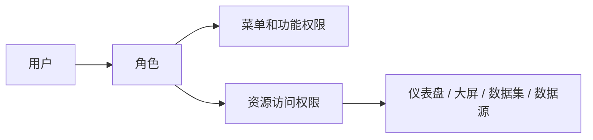

Crest 的权限管理建议按“角色承载职责、用户加入角色、资源按需授权”的方式设计。这样能降低后续维护成本，也便于审计。

入口：系统管理 → 角色管理、权限管理。

角色管理页用于维护“岗位职责”。图中重点看角色名称、角色描述、创建时间和操作入口。角色名称要面向管理语义，例如“数据管理员”“经营看板编辑者”“外部访客”，不要使用“张三权限”“临时角色 1”。

权限管理页用于给角色配置菜单、功能和资源范围。配置时先选角色，再勾选权限。保存后必须用普通账号验证，因为管理员视角看到的菜单和普通用户不同。

## 权限模型

## 角色设计原则

| 原则 | 说明 |
| --- | --- |
| 按岗位设计 | 如平台管理员、数据管理员、分析师、查看者 |
| 最小权限 | 用户只拥有完成工作所需权限 |
| 避免个人角色 | 不为单个用户随意创建长期角色 |
| 分离管理与使用 | 管理员、编辑者、查看者职责分开 |
| 定期复核 | 每月或按审计周期检查角色成员和权限 |

## 常见角色示例

| 角色 | 适用对象 | 权限范围 |
| --- | --- | --- |
| 平台管理员 | 平台负责人 | 系统管理、用户、角色、参数、SSO、审计 |
| 数据管理员 | 数据治理人员 | 数据源、数据集、数据同步、数据权限 |
| 分析开发者 | BI 开发人员 | 创建图表、仪表盘、大屏、配置资源 |
| 业务查看者 | 业务用户 | 查看授权资源、使用筛选和导出 |
| 外部访客 | 合作方或临时用户 | 只查看指定资源，禁止管理功能 |

## 配置角色

<Steps>
  <Step>
    ### 新建角色
    在角色管理页面创建角色，名称要能表达职责，不要使用“测试”“临时”等模糊名称。
  </Step>
  <Step>
    ### 配置菜单权限
    在权限管理中为角色勾选可访问菜单和功能。
  </Step>
  <Step>
    ### 配置资源权限
    对仪表盘、大屏、数据集、数据源等资源按业务范围授权。
  </Step>
  <Step>
    ### 添加用户
    将用户加入角色，优先按岗位批量授权。
  </Step>
  <Step>
    ### 用普通账号验证
    使用非管理员账号登录，确认菜单、资源和操作按钮都符合预期。
  </Step>
</Steps>

### 示例：创建业务查看者角色

这个示例用于说明流程，实际资源名称按项目替换。

| 配置项 | 示例设置 | 说明 |
| --- | --- | --- |
| 角色名称 | 经营看板查看者 | 面向岗位或场景命名 |
| 菜单权限 | 工作台、仪表盘、数据大屏 | 不授予系统管理、数据源编辑 |
| 功能权限 | 查看、筛选、必要时导出 | 导出需按数据安全要求审批 |
| 资源权限 | 指定经营仪表盘和大屏 | 不默认开放全部资源 |
| 用户范围 | 经营部门成员 | 离岗后移出角色 |

配置完成后，用该角色账号登录，检查是否只能看到授权资源；尝试进入系统管理、数据源编辑、删除资源等入口，确认不可访问。

## 菜单权限与资源权限的区别

| 类型 | 控制什么 | 示例 |
| --- | --- | --- |
| 菜单权限 | 用户能否进入某个功能模块 | 是否能看到“数据源”“系统管理” |
| 功能权限 | 用户能否执行某类操作 | 新建、编辑、删除、导出 |
| 资源权限 | 用户能否访问某个具体资源 | 某个仪表盘、某个数据集 |
| 数据权限 | 用户能看到哪些数据范围 | 行权限、列权限、字段脱敏 |

用户拥有菜单权限，不能说明一定能看到所有资源。用户能看到资源，也不能说明可以编辑或删除。

## 权限验证方法

1. 准备一个普通测试账号。
2. 给它分配目标角色。
3. 退出管理员账号，使用普通账号登录。
4. 检查顶部菜单和侧边菜单。
5. 打开被授权资源。
6. 尝试编辑、复制、删除、导出等操作。
7. 检查不该看到的资源是否隐藏。
8. 检查审计日志是否记录关键操作。

权限验收不能只看“是否能打开页面”。还要检查页面里的按钮：编辑、删除、移动、复制、导出、分享、发布都可能是独立权限点。对只读角色而言，页面可查看不能说明可以修改资源。

## 常见问题

| 问题 | 原因 | 处理 |
| --- | --- | --- |
| 用户没有菜单 | 角色未配置菜单权限 | 在权限管理中补充菜单权限 |
| 用户看不到资源 | 资源未授权或所在空间无权限 | 配置资源权限 |
| 用户能看不能编辑 | 只有查看权限 | 补充编辑权限或调整角色 |
| 权限过大 | 用户加入了管理员或高权限角色 | 移除不必要角色 |
| 多个角色冲突 | 角色叠加导致权限扩大 | 梳理角色边界，保留必要角色 |
