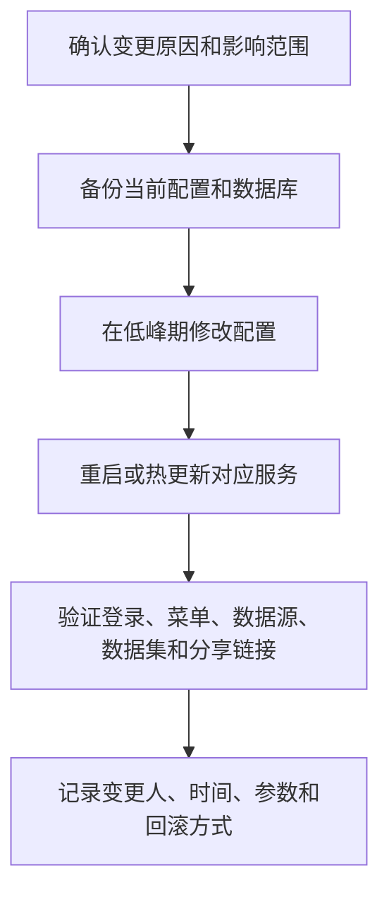

本章面向系统管理员、实施人员和运维人员，整理上线后最常见、且容易影响用户体验和系统稳定性的配置项：访问地址、HTTPS、数据库、密钥、系统参数、站点信息、字体、单点登录和分享安全。

正式环境的配置变更建议遵循一个原则：先明确影响范围，再修改配置，最后做登录、数据访问、分享和导出验证。

配置管理不是只改配置文件。一次完整变更通常包含变更申请、备份、修改、重启或热更新、业务验证、审计记录和回滚方案。公开项目或生产环境尤其要避免“先改了再说”。

## 配置变更流程

## 配置入口示例

系统参数影响平台级行为。修改前要记录原值，修改后要验证登录、数据查询、导出和分享。

站点设置影响登录页、浏览器标题、Logo 和品牌展示。公开交付前要在登录页、工作台、预览页和分享页分别检查。

SSO 配置需要和身份提供方逐项核对。回调地址、Client Secret、用户唯一标识和默认角色是常见出错点。

## 常见配置类型

| 配置类型 | 修改位置 | 是否需要重启 | 说明 |
| --- | --- | --- | --- |
| 访问端口 | 部署配置、反向代理、容器端口 | 通常需要 | 修改后要同步防火墙、负载均衡和用户访问地址 |
| 域名与 HTTPS | Nginx、Ingress、负载均衡 | 通常需要 | 推荐由统一网关托管证书 |
| 数据库连接 | 部署配置、环境变量 | 需要 | 修改前必须备份数据库和配置 |
| 加密模式与密钥 | 部署配置、环境变量 | 需要 | AES Key、AES IV 和国密 SM4 Key 不可随意变更，变更前必须评估历史数据解密影响 |
| 系统参数 | 系统管理页面 | 视参数而定 | 部分参数保存后即时生效，部分需要重新登录或刷新页面 |
| 站点信息 | 系统管理页面 | 不需要 | 修改浏览器标题、系统名称等展示信息 |
| 字体 | 系统管理页面 | 不需要 | 用于图表、仪表盘和大屏渲染 |
| SSO | 系统管理页面、身份提供方 | 通常不需要 | 需要和身份提供方参数保持一致 |
| 分享策略 | 系统管理页面 | 不需要 | 影响外部分享链接、安全码和有效期 |

<Callout type="warning" title="不要跳过备份">
  涉及数据库、密钥、端口、域名、SSO 的配置修改，都应该先备份当前配置。配置回滚不只是不保存新值，还要保证旧值、旧证书、旧数据库账号仍然可用。
</Callout>

## 配置完成后的验证清单

1. 管理员可以正常登录。
2. 普通用户可以正常登录。
3. 顶部菜单和侧边菜单显示正确。
4. 数据源连接测试成功。
5. 数据集预览、图表查询、仪表盘打开正常。
6. 分享链接在有效期、密码和权限范围内可访问。
7. 导出任务可以提交、下载和删除。
8. 审计日志能记录关键操作。

验证要覆盖管理员和普通用户两个视角。管理员可以登录，不能证明普通用户菜单、资源权限和分享访问均正常。

## 后续章节

<Cards>
  <Card title="端口、域名与 HTTPS" href="/docs/crest/configuration/port-domain-https">
    修改访问入口、反向代理、证书和安全响应头。
  </Card>
  <Card title="数据库与密钥" href="/docs/crest/configuration/database-and-secrets">
    管理数据库连接、初始化密码、加密模式、AES Key、AES IV 和国密 SM4 Key。
  </Card>
  <Card title="系统参数" href="/docs/crest/configuration/system-settings">
    修改系统参数、站点信息和字体资源。
  </Card>
  <Card title="单点登录" href="/docs/crest/configuration/sso">
    配置 OIDC、OAuth2、Casdoor 等身份认证方式。
  </Card>
  <Card title="分享安全" href="/docs/crest/configuration/share-security">
    控制分享链接、密码、有效期和外部访问风险。
  </Card>
</Cards>
