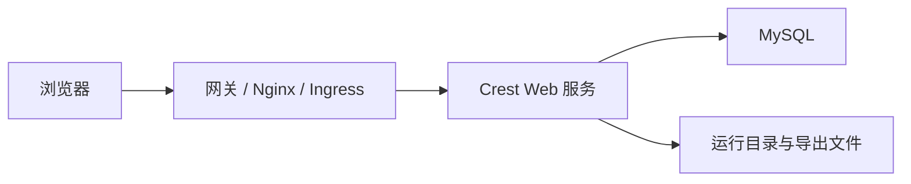

Crest 可以直接通过容器映射端口访问，也可以放在 Nginx、Ingress 或企业负载均衡后面。正式环境建议使用统一域名和 HTTPS，对外只暴露标准访问入口，内部端口由运维平台管理。

访问入口一旦确定，会影响登录地址、分享链接、SSO 回调、浏览器 Cookie 和用户收藏地址。生产环境不要频繁在 IP、端口和域名之间切换。

## 推荐访问结构



## 单机部署修改端口

单机安装后，Crest 服务通常由 Docker Compose 或系统服务托管。修改端口时要同时检查三处：

| 位置 | 需要检查什么 |
| --- | --- |
| Compose 配置 | 宿主机端口到容器端口的映射 |
| 防火墙 | 新端口是否允许访问 |
| 反向代理 | 上游地址是否指向新端口 |

操作顺序建议：

<Steps>
  <Step>
    ### 记录当前端口
    执行 `crestctl status`，记录当前服务状态、容器名称和端口映射。
  </Step>
  <Step>
    ### 修改服务配置
    在部署目录中调整端口映射或环境变量。不应直接修改容器内部文件，容器重建后相关修改会丢失。
  </Step>
  <Step>
    ### 重启服务
    执行 `crestctl restart`，等待服务重新启动。
  </Step>
  <Step>
    ### 验证访问
    用浏览器访问新地址，确认登录页、工作台和系统管理页面正常。
  </Step>
</Steps>

端口修改后，先打开登录页确认入口可访问：


如果登录页能打开但登录失败，继续检查反向代理头、Cookie、HTTPS 和后端接口请求。

## 使用 Nginx 代理

下面示例展示了常见的 HTTPS 代理方式。实际证书路径、域名和上游端口应以现场环境为准。

```nginx
server {
    listen 443 ssl http2;
    server_name crest.example.com;

    ssl_certificate     /etc/nginx/certs/crest.example.com.crt;
    ssl_certificate_key /etc/nginx/certs/crest.example.com.key;

    client_max_body_size 200m;

    location / {
        proxy_pass http://127.0.0.1:8100;
        proxy_set_header Host $host;
        proxy_set_header X-Real-IP $remote_addr;
        proxy_set_header X-Forwarded-For $proxy_add_x_forwarded_for;
        proxy_set_header X-Forwarded-Proto https;
        proxy_read_timeout 300s;
    }
}
```

配置完成后，使用最终域名访问，不要再用后端端口绕过代理验证。只有通过最终域名验证成功，分享链接和 SSO 回调才有参考意义。

## HTTPS 配置要点

| 项目 | 建议 |
| --- | --- |
| 证书 | 使用企业证书平台或可信 CA 证书，设置到期提醒 |
| 协议 | 对外只开放 HTTPS，HTTP 统一跳转到 HTTPS |
| 上传大小 | 根据 Excel、图片和字体文件大小调整 `client_max_body_size` |
| 超时 | 导出、预览、复杂查询场景需要适当提高代理超时 |
| 真实 IP | 保留 `X-Forwarded-For`，便于审计和安全分析 |

<Callout type="info" title="关于访问地址">
  如果站点地址、分享地址或身份提供方回调地址使用域名，修改域名后要同步检查系统参数、SSO 回调地址和旧分享链接。
</Callout>

## 修改后验证

1. 使用新域名打开登录页。
2. 登录后刷新工作台，确认没有静态资源 404。
3. 打开仪表盘和大屏，确认图片、字体、预览页面加载正常。
4. 生成一个分享链接，使用无登录浏览器访问。
5. 提交一个导出任务，确认导出中心可以下载文件。
6. 在审计日志中确认登录和访问记录正常。


审计日志中能看到真实来源 IP，有助于后续安全排查。如果所有请求都显示代理服务器 IP，需要检查 `X-Forwarded-For` 和代理链配置。
