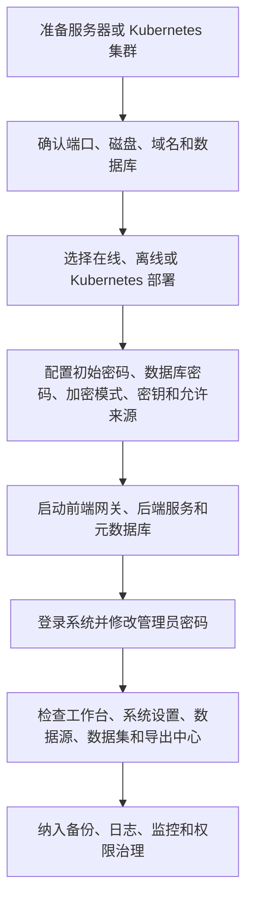

本章面向负责安装、交付和运维 Crest 的人员，覆盖部署前准备、安装过程、服务管理、外部数据库、Kubernetes 和上线检查。Crest v1.5.7 采用前后端分离运行形态：前端网关、后端服务和元数据库分别运行，监控组件可按需启用。正式上线时，应同时确认访问地址、数据库、密钥、备份、日志、监控、缓存任务和权限治理，避免系统虽然可访问但不具备长期运行条件。

## 选择部署方式

| 部署方式 | 推荐场景 | 维护成本 | 说明 |
| --- | --- | --- | --- |
| 单机在线安装 | 有网络访问镜像仓库，需要完成单节点部署 | 低 | 使用 `installer/install.sh` 自动安装 Docker、配置目录、前端网关、后端服务和系统服务 |
| 单机离线安装 | 服务器不能访问外网 | 中 | 先制作包含前端、后端、MySQL 和可选监控镜像的完整离线包，再上传到目标服务器执行安装 |
| 应用镜像升级包 | 已有内网环境只需替换 Crest 前后端镜像 | 低 | 使用 `crest-app-images-*`，不包含 MySQL、Prometheus、Grafana 和完整安装脚本 |
| Kubernetes 内置 MySQL | 集群内验证或测试 | 中 | 部署 `crest`、`crest-service` 和 MySQL StatefulSet |
| Kubernetes 外部 MySQL | 正式集群环境 | 高 | 推荐生产使用，数据库由平台统一维护 |
| 自定义 Docker Compose | 已有统一运维模板 | 中 | 参考安装包或 `deploy/split` 中的 Compose 模板自行纳管 |

<Callout type="warning" title="生产环境建议">
  正式环境优先选择固定域名、HTTPS、外部 MySQL、定期备份和统一日志采集。Crest、数据库和备份文件不应按临时测试资源管理。
</Callout>

## 部署流程总览

## 部署前必须确认的事项

| 项目 | 要求 |
| --- | --- |
| 访问地址 | 确认最终给用户访问的域名、协议和端口 |
| 数据库 | 明确使用内置 MySQL 还是外部 MySQL |
| 密码与密钥 | 初始化密码、数据库密码、AES Key、AES IV、国密模式下的 SM4 Key 必须可追溯、可备份 |
| 加密模式 | 默认使用 `standard`；需要 SM2、SM3、SM4 时在安装前规划 `sm-suite` |
| 备份 | 明确数据库和运行目录备份位置 |
| 日志 | 明确日志保留周期和排查方式 |
| 监控 | 需要 Prometheus / Grafana 时，提前规划 token、端口、看板和告警接入 |
| 权限 | 首次上线后尽快配置组织、角色和资源权限 |

## 安装完成后的第一件事

安装脚本会输出管理员账号和初始密码。第一次登录后请立即修改密码，并把管理员账号纳入账号管理流程。

登录后先进入工作台，确认系统页面、资源统计和演示资源是否正常显示。

## 后续章节

<Cards>
  <Card title="环境要求" href="/docs/crest/deployment/requirements">
    部署前需要准备的服务器、端口、Docker、数据库和安全条件。
  </Card>
  <Card title="单机在线安装" href="/docs/crest/deployment/single-node">
    使用安装脚本完成单机部署，并理解安装目录和核心配置项。
  </Card>
  <Card title="离线安装" href="/docs/crest/deployment/offline">
    制作离线包、上传、解压、安装和校验。
  </Card>
  <Card title="Kubernetes 部署" href="/docs/crest/deployment/kubernetes">
    使用 Kustomize 部署内置 MySQL 或外部 MySQL 模式。
  </Card>
  <Card title="外部 MySQL" href="/docs/crest/deployment/external-mysql">
    准备生产数据库、账号、字符集和连接参数。
  </Card>
  <Card title="服务管理" href="/docs/crest/deployment/service-management">
    使用 `crestctl` 和 Docker Compose 管理服务。
  </Card>
  <Card title="部署后检查" href="/docs/crest/deployment/post-check">
    按清单验证页面、账号、数据、导出、权限和日志。
  </Card>
  <Card title="监控与可观测性" href="/docs/crest/maintenance/observability">
    说明 v1.5.4 起提供的 Prometheus 指标、Grafana 看板和告警口径。
  </Card>
</Cards>
