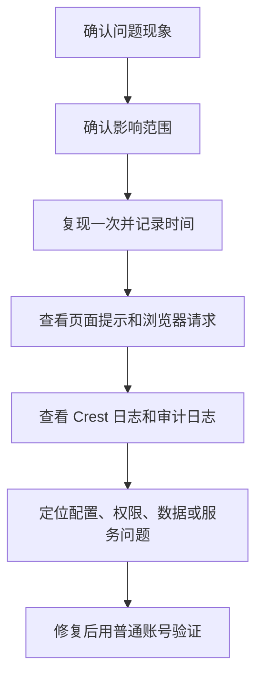

本页汇总 Crest 使用和运维中的高频问题。建议先按问题类型进入对应章节，再按“现象 → 可能原因 → 处理顺序”排查。

## 问题分类

<Cards>
  <Card title="安装与登录" href="/docs/crest/faq/install-login">
    服务无法访问、初始密码、登录失败、端口和 HTTPS 问题。
  </Card>
  <Card title="权限与账号" href="/docs/crest/faq/permissions">
    菜单不可见、资源不可见、角色授权和账号生命周期问题。
  </Card>
  <Card title="数据与可视化" href="/docs/crest/faq/data-visualization">
    数据源、数据集、图表、仪表盘、大屏和导出问题。
  </Card>
  <Card title="SSO 与 Kubernetes" href="/docs/crest/faq/sso-kubernetes">
    单点登录、回调地址、Ingress、Pod 状态和集群部署问题。
  </Card>
</Cards>

## 排查基本顺序

## 提交问题时建议提供

| 信息 | 示例 |
| --- | --- |
| 环境 | 单机、离线、Kubernetes、外部 MySQL |
| 版本 | Crest 版本号、部署时间 |
| 用户 | 发生问题的账号和角色 |
| 页面 | 具体菜单、资源名称、访问地址 |
| 时间 | 问题发生时间，精确到分钟更好 |
| 现象 | 页面报错、空白、无权限、导出失败等 |
| 日志 | 应用日志、审计日志、浏览器错误 |
