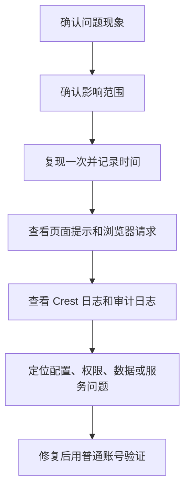

本页汇总 Crest 使用和运维中的高频问题。建议先按问题类型进入对应章节，再按“现象 → 可能原因 → 处理顺序”排查。

排查问题时，不建议直接修改配置。应先复现问题、保留截图、记录发生时间，再查看审计日志、应用日志和浏览器提示。部分问题表现为“页面打不开”或“图表没数据”，实际原因可能在权限、数据源、缓存、代理或后台任务。

多数问题可先从工作台判断影响范围。能登录但菜单少，通常是权限问题；工作台空白或资源统计异常，可能是接口、权限或元数据问题；只有某个资源异常，则优先检查该资源的上游数据和权限。

## 问题分类

<Cards>
  <Card title="安装与登录" href="/docs/crest/faq/install-login">
    服务无法访问、初始密码、登录失败、端口和 HTTPS 问题。
  </Card>
  <Card title="权限与账号" href="/docs/crest/faq/permissions">
    菜单不可见、资源不可见、角色授权和账号生命周期问题。
  </Card>
  <Card title="数据与可视化" href="/docs/crest/faq/data-visualization">
    数据源、数据集、图表、仪表盘、大屏和导出问题。
  </Card>
  <Card title="SSO 与 Kubernetes" href="/docs/crest/faq/sso-kubernetes">
    单点登录、回调地址、Ingress、Pod 状态和集群部署问题。
  </Card>
</Cards>

## 排查基本顺序

这个顺序适合大多数问题。先确认现象和影响范围，是为了避免把单个用户的权限问题误判成系统故障；先记录时间，是为了在审计日志和应用日志中快速定位；最后用普通账号验证，是为了避免管理员账号验证通过但业务用户仍然不可用。

## 提交问题时建议提供

| 信息 | 示例 |
| --- | --- |
| 环境 | 单机、离线、Kubernetes、外部 MySQL |
| 版本 | Crest 版本号、部署时间 |
| 用户 | 发生问题的账号和角色 |
| 页面 | 具体菜单、资源名称、访问地址 |
| 时间 | 问题发生时间，精确到分钟更好 |
| 现象 | 页面报错、空白、无权限、导出失败等 |
| 日志 | 应用日志、审计日志、浏览器错误 |

## 常用截图

提交问题时建议附上关键页面截图。截图不需要包含敏感密码、Token 或真实客户数据，但要能看清页面入口、资源名称、时间和报错提示。

| 截图 | 适用问题 |
| --- | --- |
| 登录页 | 服务不可访问、SSO 按钮异常、品牌信息不对 |
| 工作台 | 登录后页面异常、菜单缺失、资源数量异常 |
| 用户管理 | 账号状态、角色归属、离职账号处理 |
| 权限管理 | 菜单权限、资源权限、角色授权 |
| 数据源详情 | 连接失败、表结构读取失败 |
| 数据集预览 | 字段为空、SQL 无结果、缓存问题 |
| 图表编辑器 | 指标口径、维度指标配置、过滤条件 |
| 导出中心 | 导出失败、任务积压、文件下载失败 |
| 审计日志 | 操作追踪、权限变更、删除资源排查 |

公开工单或社区 issue 中不得粘贴真实密码、数据库地址、身份证号、手机号、客户名称和商业指标明细。必要时可打码，但应保留足够的字段结构和错误信息，便于判断问题。
