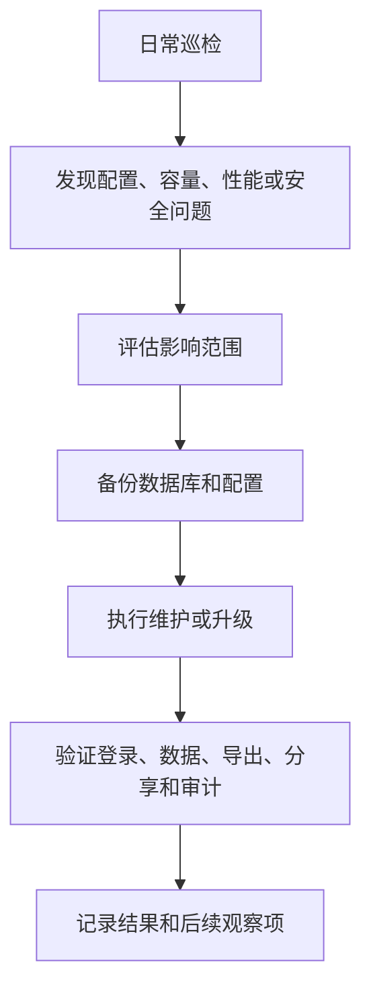

Crest 上线后，运维重点从“系统可访问”转为“系统可持续运行”。本章覆盖备份、恢复、升级、回滚、日志、健康检查和导出文件治理，适合运维人员、系统管理员和实施负责人使用。

## 日常维护边界

| 工作 | 建议负责人 | 频率 |
| --- | --- | --- |
| 服务状态检查 | 运维 | 每日 |
| 数据库备份检查 | DBA / 运维 | 每日 |
| 导出文件清理 | 运维 / 管理员 | 每周 |
| 分享链接巡检 | 管理员 | 每月 |
| 角色与权限复核 | 管理员 / 安全负责人 | 每月或按审计要求 |
| 升级评估 | 运维 / 实施 / 业务负责人 | 版本发布前 |
| 恢复演练 | 运维 / DBA | 每季度 |

## 维护流程总览

## 维护窗口

涉及以下操作时，建议安排维护窗口：

- 升级 Crest 版本。
- 修改数据库连接。
- 修改 AES Key、AES IV 等加密配置。
- 调整端口、域名、证书或反向代理。
- 执行数据库恢复。
- 大规模清理导出文件或运行目录。
- 迁移部署节点。

<Callout type="warning" title="升级前一定要验证备份">
  备份文件存在不代表可以恢复。正式升级前，至少要确认备份文件可读取、大小合理，并在条件允许时完成一次恢复演练。
</Callout>

## 后续章节

<Cards>
  <Card title="备份与恢复" href="/docs/crest/maintenance/backup-restore">
    数据库、运行目录、配置、字体和导出文件的备份恢复流程。
  </Card>
  <Card title="升级与回滚" href="/docs/crest/maintenance/upgrade-rollback">
    版本升级前检查、升级步骤、验证和回滚策略。
  </Card>
  <Card title="日志与健康检查" href="/docs/crest/maintenance/logs-health">
    服务状态、日志排查、导出中心和审计日志检查方法。
  </Card>
</Cards>
