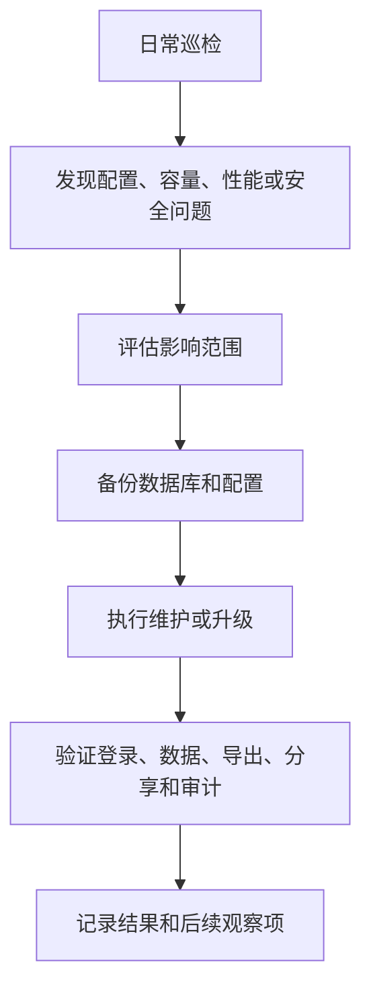

Crest 上线后，运维重点从“系统可访问”转为“系统可持续运行”。本章覆盖备份、恢复、升级、回滚、日志、健康检查、监控告警和导出文件治理，适合运维人员、系统管理员和实施负责人使用。

维护工作应围绕“可恢复、可排查、可审计、可观察”展开。生产可用不仅要求系统可访问，还要求备份可恢复、日志可定位、指标可告警、权限可复核、分享可回收、导出失败可处理。

## 日常维护边界

| 工作 | 建议负责人 | 频率 |
| --- | --- | --- |
| 服务状态检查 | 运维 | 每日 |
| 数据库备份检查 | DBA / 运维 | 每日 |
| 导出文件清理 | 运维 / 管理员 | 每周 |
| 监控指标巡检 | 运维 | 每日或按告警策略 |
| 分享链接巡检 | 管理员 | 每月 |
| 角色与权限复核 | 管理员 / 安全负责人 | 每月或按审计要求 |
| 升级评估 | 运维 / 实施 / 业务负责人 | 版本发布前 |
| 恢复演练 | 运维 / DBA | 每季度 |

## 维护流程总览

## 每日巡检怎么做

<Steps>
  <Step>
    ### 看服务状态
    使用 `crestctl status` 或 Kubernetes 命令确认服务运行、端口监听、Pod 或容器没有频繁重启。
  </Step>
  <Step>
    ### 打开核心页面
    登录管理员账号，打开工作台、数据源、数据集、仪表盘、大屏预览和系统管理。
  </Step>
  <Step>
    ### 检查导出中心
    查看是否有大量等待中、执行中或失败任务。导出异常经常反映数据查询、文件目录或后台任务问题。
  </Step>
  <Step>
    ### 查看审计日志
    检查异常登录、权限变更、资源删除、分享开启和系统配置修改。
  </Step>
  <Step>
    ### 记录结果
    将异常、处理动作和待观察项写入运维台账。
  </Step>
</Steps>

导出中心是判断后台任务健康的入口。失败任务较多时，应查看失败对象、失败时间和错误信息，而不是仅要求用户重试。

审计日志用于复盘关键操作。资源突然不可见、分享链接异常、权限变化和账号问题，都应结合审计日志排查。

## 维护窗口

涉及以下操作时，建议安排维护窗口：

- 升级 Crest 版本。
- 修改数据库连接。
- 修改加密模式、AES Key、AES IV、国密 SM4 Key 等加密配置。
- 调整端口、域名、证书或反向代理。
- 执行数据库恢复。
- 大规模清理导出文件或运行目录。
- 迁移部署节点。

<Callout type="warning" title="升级前一定要验证备份">
  备份文件存在并不等同于可恢复。正式升级前，至少要确认备份文件可读取、大小合理，并在条件允许时完成一次恢复演练。
</Callout>

## 后续章节

<Cards>
  <Card title="备份与恢复" href="/docs/crest/maintenance/backup-restore">
    数据库、运行目录、配置、字体和导出文件的备份恢复流程。
  </Card>
  <Card title="升级与回滚" href="/docs/crest/maintenance/upgrade-rollback">
    版本升级前检查、升级步骤、验证和回滚策略。
  </Card>
  <Card title="日志与健康检查" href="/docs/crest/maintenance/logs-health">
    服务状态、日志排查、导出中心和审计日志检查方法。
  </Card>
  <Card title="监控与可观测性" href="/docs/crest/maintenance/observability">
    Prometheus 指标、Grafana 看板、告警口径和安全边界。
  </Card>
</Cards>
